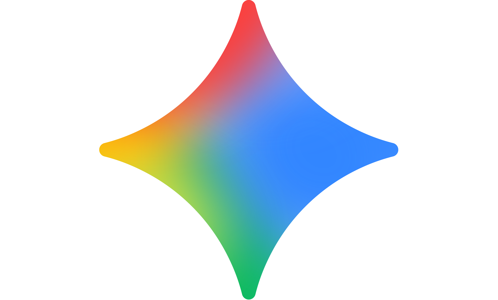

# Platform Guides

*March 2026*

Several AI platforms now offer capable general-purpose assistants, and many of them do very similar things. You do not need to learn them all, or even use all the capabilities of any one platform. The guides below cover the platforms most relevant to humanities researchers. Each can be read independently. If you are unsure where to start, the [choosing guide](#how-to-choose-a-platform) below will help you decide.

  <a class="hhg-path-card" href="../claude/">
    
Anthropic

    <h3> Claude</h3>
    
Strong for writing, analysis, and coding. Clean product hierarchy.

  </a>
  <a class="hhg-path-card" href="../chatgpt/">
    
OpenAI

    <h3> ChatGPT</h3>
    
Broad capabilities, large ecosystem. Deep research and custom GPTs.

  </a>
  <a class="hhg-path-card" href="../gemini/">
    
Google

    <h3> Gemini</h3>
    
Deep ecosystem integration, strong multimodal support.

  </a>
  <a class="hhg-path-card" href="copilot/">
    
Microsoft

    <h3> Copilot</h3>
    
AI in Microsoft 365: free vs institutional, data protection, and getting useful results.

  </a>

A detailed guide for local open-weights setups is planned.

---

## How to Choose a Platform

!!! panic "Don't Panic"
    You do not need to pick the right platform on your first try. The core skill — learning to work well with an AI assistant — transfers across all of them. Start anywhere. Switch when you have a reason to.

### The short version

All major platforms now offer capable free tiers. The differences that matter most for humanities researchers are price, privacy, institutional availability, and how far you want to push agentic or multimodal capabilities. If you have no strong reason to choose one over another, start with whichever is easiest to sign up for and move on when you have a specific need.

---

### Questions to ask

#### What is your budget?

**Nothing for now.** ChatGPT Free gives access to GPT-4o and limited GPT-5.x. Claude Free and Gemini Free are also capable. All three are good enough for a genuine first encounter with what these tools can do. Start with whichever is easiest to sign up for.

Free tiers give you a realistic sense of the *nature* of what these tools can do — the kinds of tasks they handle, how conversation works, what file uploads feel like. But they do not reliably represent the *quality* of output you can expect from a paid tier. Free-tier models are often older, slower, or more heavily rate-limited, and may not produce results good enough for professional or academic work. If you try a free tier and find the output underwhelming, that is a reason to try a paid tier before writing the technology off, not a reason to stop.

**Around £20/month for individual use.** Claude Pro and ChatGPT Plus are both roughly £20/month (or equivalent). Claude Pro gives access to Opus (Anthropic's most capable model), Claude Code, Cowork, and higher usage limits. ChatGPT Plus gives expanded access to GPT-5.x, deep research, agent mode, Codex, and custom GPTs. Either is a reasonable choice. If your main work is writing, reading, and analysis, both are strong. If you want agentic coding, Claude Code is currently more mature for that workflow.

**Institutional budget.** Ask your IT department what is already available. Many UK universities have Microsoft 365 licences that include Copilot. Some have negotiated institutional access to ChatGPT (Edu/Enterprise) or are exploring Anthropic's offerings. Using an institutional platform is almost always better for data governance than a personal subscription.

#### Do you need privacy guarantees?

**Personal, low-risk, exploratory work.** Any consumer plan is fine. Be aware that consumer ChatGPT may use your conversations for model training unless you opt out. Claude and Gemini have their own data policies — check the current terms.

**Institutional data, student data, or sensitive material.** Use an institutional platform (Copilot via Microsoft 365, ChatGPT Enterprise/Edu, or equivalent). These typically include contractual commitments that your data will not be used for training.

**Maximum control.** Open-weights models (such as Llama, Mistral, or Qwen) can be run locally on your own hardware. Nothing leaves your machine. This requires technical setup but gives complete data sovereignty. See the [terminology section below](#essential-terminology) for what "open weights" means.

#### Are you interested in multimodal capabilities?

**Image understanding and generation.** ChatGPT (via DALL-E and GPT-4o/5.x vision) and Gemini are currently strongest here. Claude can analyse images but does not generate them.

**Voice.** ChatGPT and Gemini both offer voice interaction. Claude has more limited voice support.

**Video.** Gemini has native video understanding. Other platforms are more limited. For most humanities work this is not yet a primary need.

!!! leifnote "Leif's Notes — on choosing by company"
    None of the major AI platforms is without ethical questions — on corporate governance, environmental impact, labour practices, data handling, and societal risk. The differences between them are real but not straightforward, and they change as companies evolve. Rather than offering a ranking here, I would encourage you to do your own research. (LLMs themselves can be surprisingly candid about the controversies surrounding their own makers — try asking.)

    Many academics I speak to tend to default to Anthropic (Claude) as having arguably the strongest explicit commitment to safe and ethical AI development. That is an observation of a trend among colleagues, not a formal endorsement from this guide. Your own priorities — on privacy, on environmental impact, on corporate structure, on military contracts — may lead you to a different conclusion.

---

## A note on memory and lock-in

Most platforms now offer some form of memory: the assistant learns your preferences, context, and working style over time. This is genuinely useful — you will get more out of an AI assistant after weeks of use than on day one.

The important thing to know is that the core skill transfers. What you learn about prompting, verification, and working with AI on one platform applies on every other. If you later switch platforms, you will lose accumulated memory but not accumulated competence.

Some platforms (Claude, ChatGPT) allow you to view and manage what the system remembers. Formal memory export and import across platforms is not yet straightforward, but the practical lock-in is low: switching costs time, not money or data.

---

## Essential terminology { #essential-terminology }

Brief, plain-language definitions. Cross-reference the [Glossary](../glossary/) for fuller explanations.

### Frontier models

The most capable AI models currently available from leading companies. As of early 2026, these include Anthropic's Claude Opus, OpenAI's GPT-5.x, and Google's Gemini Ultra. "Frontier" is a moving target — today's frontier model is next year's baseline.

### Hyperscalers

The very large cloud computing companies — primarily Amazon Web Services (AWS), Microsoft Azure, and Google Cloud — whose infrastructure underpins most AI services. When you use ChatGPT, Claude, or Gemini, your queries are processed on hardware owned by one of these companies. This matters for data governance: your data may be stored and processed in jurisdictions you did not choose.

### Open-weights models

AI models whose internal parameters (weights) have been published, allowing anyone to download, run, modify, and study them. Examples include Meta's Llama, Mistral's models, and Alibaba's Qwen. "Open weights" is more precise than "open source" because the training data, training code, and licence terms are not always fully open. Running open-weights models locally gives you complete control over your data but requires technical setup and capable hardware.

### Parameters

The internal numerical values that define what a model has learned. Larger models have more parameters (GPT-4 is estimated at over a trillion; smaller open-weights models may have 7–70 billion). More parameters generally means more capability but also more computational cost. You do not need to know the number to use a model, but you will encounter the term.

### Context window

The amount of text (and other input) a model can process in a single conversation. Measured in tokens (roughly ¾ of a word). Larger context windows allow the model to work with longer documents or maintain longer conversations. As of 2026, frontier models typically offer context windows of 100,000–1,000,000+ tokens, though quality of attention degrades over very long contexts.

!!! leifnote "Leif's Notes"
    The model landscape changes fast. This page gives you durable questions rather than perishable answers. The specific recommendations are dated March 2026; if you are reading this later, check the individual platform pages for current details.
